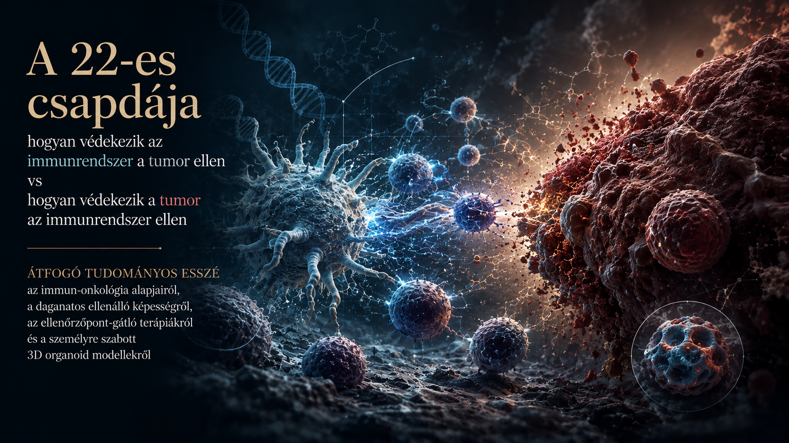

# A 22-es csapdája

## Hogyan védekezik az immunrendszer a tumor ellen VS hogyan védekezik a tumor az immunrendszer ellen

*ÁTFOGÓ TUDOMÁNYOS ESSZÉ az immun-onkológia alapjairól, a daganatos ellenálló képességról, az ellenörzöpont-gátló terápiákról és a személyre szabott 3D organoid modellekról*

---

**Author:** Tamás Regenyi  
**Published:** August 2026

---

## Executive Summary

xxx

### 🔑 Főbb Megállapítások

xxx

### 🌐 Filozófiai Konklúzió

xxx

---

## Key Topics

- Artificial Intelligence
- Geopolitics
- Digital Sovereignty
- Europe
- Hungary
- Technology and Economic Transformation
- Global Power Shifts

---

## Download the full essay

📄 [Download the full essay PDF](pdf/Tamas-Regenyi-A-cethal-hatan-2026.pdf)

---

## About the Author

Tamás Regenyi has more than three decades of experience in technology, telecommunications, digital transformation, healthcare AI and digital pathology. He has held leadership positions at Ericsson, Cisco, 3DHISTECH and Aiforia.

---

## Connect

LinkedIn: [Tamás Regenyi on LinkedIn](https://www.linkedin.com/in/tamas-regenyi-1a1390/)
