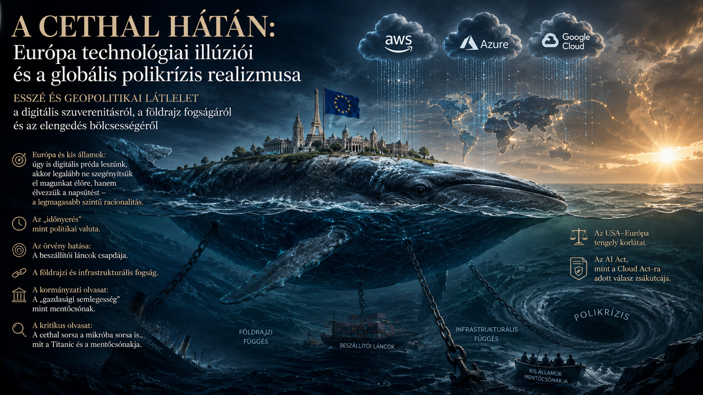

# A cethal hátán

## Európa technológiai illúziói és a globális polikrízis realizmusa

*Esszé és geopolitikai látlelet a digitális szuverenitásról, a földrajz fogságáról és az elengedés bölcsességéről*

---

**Author:** Tamás Regenyi  
**Published:** July 2026

---

## Executive Summary

Ez a tanulmány a 2026-os európai és magyar IT és MI technológiai döntések (mint az **EuroHPC JU MI-gigagyárak**, az **IRIS² műholdprogram** és a nemzeti hozzájárulási megállapodások) mögött húzódó nyers geopolitikai és gazdasági realitásokat elemzi. A politikai kommunikáció felszíni rétegeit lehántva a mű egy rendszerszintű kritikát fogalmaz meg Európa és Magyarország jövőképével kapcsolatban.

### 🔑 Főbb Megállapítások

* **A Függetlenség Paradoxonja (Az Nvidia-csapda):** Európa milliárdos hitelekből épít saját szuperszámítógép-központokat és mesterségesintelligencia-gyárakat, ám a technológia belső motorját (a GPU chipeket) továbbra is az Egyesült Államokból (Nvidia) és Ázsiából (TSMC) kénytelen beszerezni. A fizikai hardver birtoklása nem teremt valódi szuverenitást egy globálisan összefonódott beszállítói láncban.
* **A Felhő-Paranoia és a Piaci Realitás:** Éles különbséget kell tenni a reális **Adatbiztonság** (ki látja az adatokat?) és az illuzórikus **Technológiai Függetlenség** (mi van, ha lekapcsolnak minket?) között. Európa egy szoftveresen és matematikai titkosítással (End-to-End, hibrid felhő) olcsón megoldható adatvédelmi problémát akar orvosolni egy méregdrága, államilag dotált és fenntarthatatlan fizikai hardver-monopólium kiépítésével, amely képtelen versenyre kelni az amerikai hiperskálázók (AWS, Azure, Google Cloud) méretgazdaságosságával.
* **A Földrajz a Sors (A Cethal-Hasonlat):** Magyarország mint szárazföldi, nyitott és exportfüggő kisállam nem képes a "gazdasági semlegesség" mentőcsónak-stratégiáját megvalósítani. Földrajzi és infrastrukturális helyzete miatt az ország egy **mikróba a haldokló európai cethal hátán**. A süllyedő európai gazdaság (a Titanic) akkora vákuumot gerjeszt, amely a keletre nyitó, de a nyugati piacokból élő hazai gyártókapacitásokat is elkerülhetetlenül a mélybe rántja.
* **A Halál előtti Rángatógörcs:** Az exponenciális technológiai innováció és az európai bürokratikus stagnálás (pl. a korlátozó *AI Act*) közötti olló olyan sebességgel nyílik ki, amely Európát 10 éven belül a **"Skanzen-Európa" forgatókönyvbe** kényszeríti: egy jóléti, turizmusból és múltból élő, de technológiailag teljesen alárendelt tech-gyarmati státuszba.

### 🌐 Filozófiai Konklúzió

A globális **polikrízis kora** – a klímaváltozás, a demográfiai feszültségek, az erőforrások kimerülése és az ellenőrizetlen MI – a nemzetállami és blokkok közötti versengést irracionálissá és felesleges fegyverkezési versennyé teszi. 

A tanulmány a pusztító **fogolydilemma** elutasítása mellett érvel. Az egyéni és stratégiai bölcsesség szintjén felértékelődik a **"küllő-szemlélet"**: a belátás, hogy az emberiség csupán egy darab küllő a természet és a történelem láthatatlan kerekében. A megvalósíthatatlan technológiai szuverenitási harcok helyett a racionalitás a lokális feszültségmentesítést, a szomszédsági békét és a minőségi létezés megélését diktálja – **élvezni a napsütést, ameddig süt.**

---

## Key Topics

- Artificial Intelligence
- Geopolitics
- Digital Sovereignty
- Europe
- Hungary
- Technology and Economic Transformation
- Global Power Shifts

---

## Download the full essay

📄 [Download the full essay PDF](pdf/Tamas-Regenyi-A-cethal-hatan-2026.pdf)

---

## About the Author

Tamás Regenyi has more than three decades of experience in technology, telecommunications, digital transformation, healthcare AI and digital pathology. He has held leadership positions at Ericsson, Cisco, 3DHISTECH and Aiforia.

---

## Connect

LinkedIn: [Tamás Regenyi on LinkedIn](https://www.linkedin.com/in/tamas-regenyi-1a1390/)
