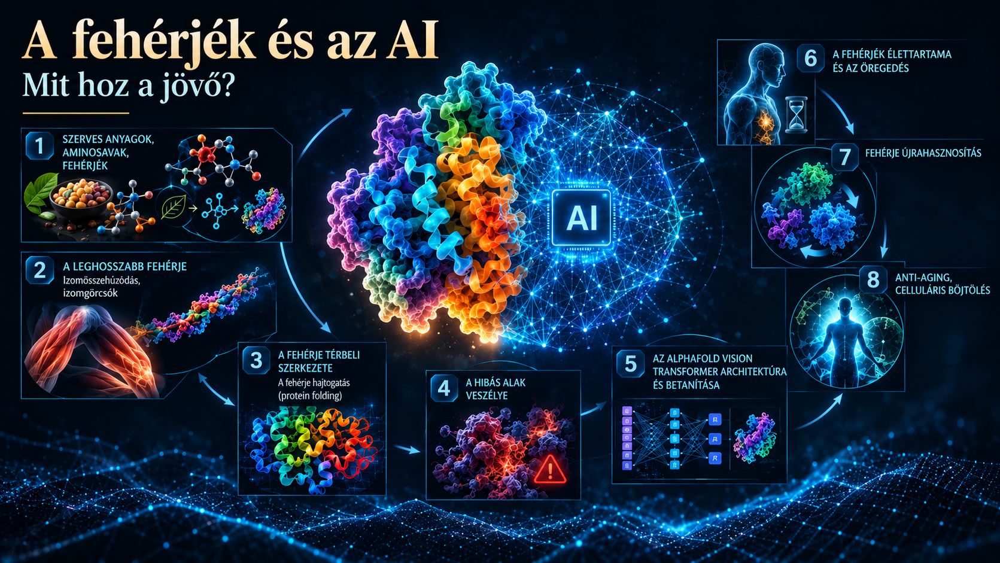

# A fehérje és az AI

## The Architecture of Proteostasis: From AlphaFold Neural Networks to Longevity Medicine

*ÁTFOGÓ TUDOMÁNYOS ESSZÉ a fehérjeszerkezet, a generatív mesterséges intelligencia és a celluláris öregedésgátlás molekuláris összefüggéseiről*

---

**Author:** Tamás Regenyi  
**Published:** September 2026

---

## Executive Summary

Ez az  esszé bemutatja, miként alakítja át a generatív mesterséges intelligencia, különösen az AlphaFold 3 és a Transformer-architektúra a **modern biokémiát** azáltal, hogy atomi pontossággal fejti meg a fehérjehajtogatás és a molekuláris struktúrák évtizedes rejtélyeit. A fehérjék térbeli formájának megértése közvetlen kulcsot ad a kezünkbe  összetett biológiai folyamatok irányításához. Az esszé összeköti a fehérje-újrahasznosítás és a proteosztázis hatékonyságát az **anti-aging orvoslással**, rávilágítva arra, hogy a sejtek időszakos böjttel serkentett autofágiája és az MI-vel tervezett mesterséges enzimek jelentik az egyetlen valódi kiutat a **celluláris elöregedés** folyamatából.

### 🔑 Főbb Megállapítások

* **A rák-immun ciklus dinamikája:** Az immunrendszer daganatellenes válasza egy többlépcsős folyamat, amely a neoantigének kiszabadulásától a naiv T-sejtek nyirokcsomóbeli mintapásztázásán (V(D)J rekombináció) keresztül a citotoxikus T- és NK-sejtek közvetlen pusztításáig tart.
* **Az álcázás és láthatatlanság:** A tumorsejtek képesek kikapcsolni a saját „rendszámtábláikat” (MHC-I molekulák), és hamis molekuláris útleveleket (PD-L1) kifejezni, amelyekkel közvetlenül a támadás előtt bénítják meg a T-sejtek receptorait.
* **A biológiai 22-es csapdája:** Az immunrendszer aktív fellépése (például az interferon-gamma kibocsátása) paradox módon arra kényszeríti a daganatot, hogy még radikálisabban felerősítse a PD-L1 alapú védelmi vonalát és elnyomó (savas, hipoxiás) mikrokörnyezetet építsen ki maga körül.
* **Az ellenőrzőpont-gátlók forradalma:** A modern immunterápiák (Anti-PD-1, Anti-CTLA-4) nem a tumort támadják, hanem az immunrendszer fékjeit oldják fel. Ez a radikális felerősítés azonban autoimmun jellegű mellékhatásokkal (pl. colitis, pneumonitis) járhat.
* **Az immunológiai vakfoltok áthidalása:** Ha a szervezet természetes T-sejt repertoárjában nincs illeszkedő receptor a daganatra, a biotechnológia mesterséges megoldásokkal – mint a CAR-T sejtterápia, a bispecifikus BiTE molekulák és a személyre szabott mRNS-alapú rákvakcinák – kényszeríti ki a felismerést.
* **A jövő precíziós onkológiája:** A beteg daganatából laboratóriumban növesztett 3D-s organoid tenyészetek (PDO) és a „Tumor-on-a-chip” technológia lehetővé teszik a gyógyszerkombinációk előzetes, élő tesztelését, bár a rutinszerű alkalmazásukat jelenleg még az időfaktor és a magas költségek korlátozzák.

### 🌐 Filozófiai Konklúzió

Az esszé legmélyebb kontextuális tanulsága, hogy az öregedés és a fehérjék szétesése nem egy külső, sorsszerű csapás, hanem a szervezet saját, „túlhajtott” anyagcsere-gyárának elkerülhetetlen mellékterméke. A sejtjeinkben zajló szüntelen munka és az életet fenyegető szilárd salakanyagok felhalmozódása egy tökéletes biológiai paradoxon: maga a működés és a növekedés kényszeríti ki azt a belső mikroszkopikus zsúfoltságot, amely végül fizikailag fojtja meg a sejtet. A külső táplálás és a folyamatos növekedés erőltetése közvetlenül altatja el a szervezet belső takarító génjeit, vagyis a bőség állapota zárja le azokat a zsilipkapukat, amelyek az elöregedett fehérjék lebontásáért felelnének.

Ez a dinamika rávilágít arra, hogy a biológiai hanyatlás elleni küzdelemben a statikus, külső beavatkozások helyett az adaptív, rendszerszintű és ciklikus megközelítések jelentik az egyetlen valódi kiutat a sejtszintű elöregedés csapdájából. A megvonás – az időszakos böjt és az autofágia – nem a szervezet sanyargatása, hanem az az intelligens impulzus, amely a sejtet a saját belső hulladékának radikális újrahasznosítására kényszeríti. Azzal, hogy a mesterséges intelligencia révén képessé válunk a természet parancsikonjainak megfejtésére és olyan „szemétevő” enzimek tervezésére, amelyek feloldják a lebonthatatlan fehérjecsomókat, a tudomány nem egy idegen kódot kényszerít a testre, hanem visszatanítja a sejtet arra az evolúciós tisztaságra, amelyet az idő múlása elfeledtetett vele.

---

## Key Topics
- Proteins as the Molecular Machinery of Life
- Biochemical Foundations of Amino Acids and Macromolecular Complexes
- Biomechanical Mechanisms of Muscle
- The Energetics of Adenoline Triphosphate (ATP) Hydrolysis
- The Thermodynamic Problem of Protein Folding
- The Levinthal Paradox
- The Neural Network Revolution: Structural Prediction via AlphaFold
- Transformer-Based Self-Attention Networks
- Training Methodologies, MSA, and Multi-Modal Refinements in AlphaFold
- Proteostasis, Cellular Degradation, and Longevity Pathways
- The Accumulative Waste Theory of Aging
- The Intermittent Fasting Dynamics
- Future Horizons in De Novo Protein Design
---

## Download the full essay

📄 [Download the full essay PDF](pdf/Tamas-Regenyi-A-feherje-es-az-AI-2026.pdf)

---

## About the Author

Tamás Regenyi has more than three decades of experience in technology, telecommunications, digital transformation, healthcare AI and digital pathology. He has held leadership positions at Ericsson, Cisco, 3DHISTECH and Aiforia.

---

## Connect

LinkedIn: [Tamás Regenyi on LinkedIn](https://www.linkedin.com/in/tamas-regenyi-1a1390/)
