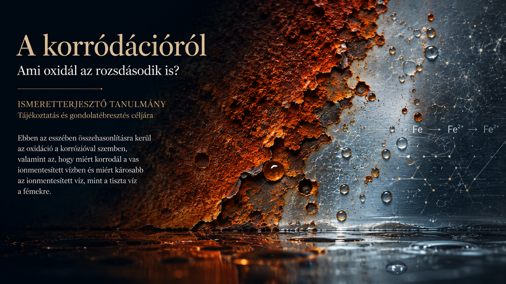

# A korródációról

## Ami oxidál az rozsdásodik is?

*Ismeretterjesztő Tanulmány - Tájékoztatás és gondolatébresztés céljára*

---

**Author:** Tamás Regenyi  
**Published:** August 2026

---

## Executive Summary

Ebben az esszében összehasonlításra kerül az **oxidáció** a **korrózióval** szemben.

### 🔑 Főbb Megállapítások

* **Miért korrodál a vas ionmentesitett vizben?**
* **Miért károsabb az ionmentesített víz, mint a tiszta víz a fémekre?** 

---

## Key Topics

- Oxidáció
- Korrodáció (korrozió)

---

## Download the full essay

📄 [Download the full essay PDF](pdf/Tamas-Regenyi-A-korrodaciorol-2026.pdf)

---

## About the Author

Tamás Regenyi has more than three decades of experience in technology, telecommunications, digital transformation, healthcare AI and digital pathology. He has held leadership positions at Ericsson, Cisco, 3DHISTECH and Aiforia.

---

## Connect

LinkedIn: [Tamás Regenyi on LinkedIn](https://www.linkedin.com/in/tamas-regenyi-1a1390/)
