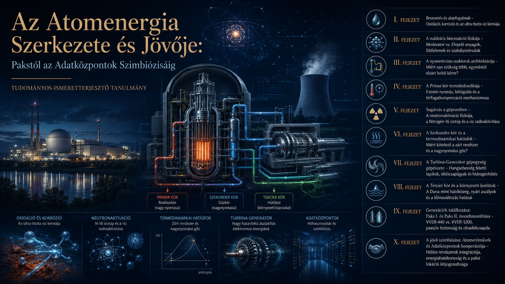

# Az Atomenergia Szerkezete és Jövője

## Pakstól az Adatközpontok Szimbiózisáig

*Tudományos ismeretterjesztő tanulmány az atomreaktorok hűtéséről az adatközpontokkal való potenciális kooperációról*

---

**Author:** Tamás Regenyi  
**Published:** July 2026

---

## Executive Summary

Ez a tanulmány az atomenergia-termelés biztonságának és hatékonyságának alfa-pontját, a többlépcsős hűtési architektúrát elemzi, amely az ultra-tiszta primer köri víz kémiájától a Dunát használó tercier körig garantálja a láncreakció kontrollját. A klímaváltozás miatti nyári folyómelegedés és a növekvő digitális infrastruktúra korunkban új, hibrid hűtési megoldásokat és az adatközpontokkal való energetikai szimbiózist tesz szükségessé.

### 🔑 Főbb Megállapítások (Key Findings)

* **Az ultra-tiszta víz kettőssége:** Az ionmentesített víz ásványi anyagok híján kémiailag instabil, „ionéhes” állapota miatt agresszív korróziós közeggé válik, ami a reaktor belső köreiben folyamatos és szigorú vegyi kontrollt (pl. bórsavas pufferelést) igényel.
* **A többkörös védelem elve:** A nyomottvizes reaktorok (VVER) három, fizikailag hermetikusan elválasztott köre biztosítja, hogy a radioaktivitás az erőmű belső magjában maradjon, miközben a szekunder kör nagynyomású gőze maximális mechanikai munkát végez.
* **Klímaváltozási korlátok:** A tisztán folyóvízre (átfolyós hűtésre) alapozott tercier körök a nyári aszályok és a szigorú (30 °C-os) környezetvédelmi korlátok miatt teljesítmény-visszafogásra kényszerülnek, amit a Paks II.-nél bevezetett passzív és segéd-hűtőtornyos rendszerek fognak áthidalni.
* **Nukleáris-digitális szimbiózis:** Az adatközpontok közvetlenül az atomerőmű mellé telepítése (co-location) megszünteti a hálózati szállítási veszteségeket, miközben az erőmű környezetbe távozó veszteséghője abszorpciós hűtési ciklusokon keresztül közvetlenül felhasználható a szerverek hűtésére.

### 🌐 Filozófiai Konklúzió

**Az egyensúly mint lételem:** Az atomreaktorok fizikája és kémiája arra figyelmeztet minket, hogy a legtisztább elemek (mint az ionmentesített víz) és a leghatalmasabb energiák (mint a maghasadás) önmagukban destruktívak; a technológiai civilizáció fenntarthatósága nem a nyers erőn, hanem a határok és az egyensúlyi állapotok precíz, folyamatos menedzselésén múlik.

**A hulladék átlényegülése:** Az atomerőmű és az adatközpont szimbiózisa rámutat arra, hogy a modern világban nincs abszolút értelemben vett „veszteség” vagy „hulladékhő”. Ami az egyik rendszer számára lefejtendő környezeti teher, az az integrált, rendszerszintű ökológiai gondolkodásban a digitális jövőnk legalapvetőbb hajtóerejévé és erőforrásává válhat.

---

## Key Topics

- Oxidáció és korrozió
- A nukleáris láncreakció fizikája
- A nyomottvizes atomreaktorok architektúrája
- A Primer, a Szekunder és a Tercier körök
- A neutronaktiváció
- A turbina-generátor
- Atomerőművek és adatközpontok kooperációja

---

## Download the full essay

📄 [Download the full essay PDF](pdf/Tamas-Regenyi-Atomreaktorok-hutese-2026.pdf)

---

## About the Author

Tamás Regenyi has more than three decades of experience in technology, telecommunications, digital transformation, healthcare AI and digital pathology. He has held leadership positions at Ericsson, Cisco, 3DHISTECH and Aiforia.

---

## Connect

LinkedIn: [Tamás Regenyi on LinkedIn](https://www.linkedin.com/in/tamas-regenyi-1a1390/)
